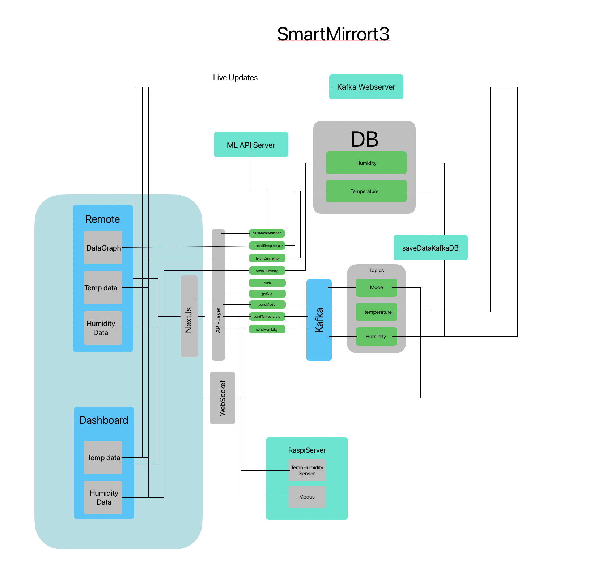

# About smartMirrort3docs

This is the smartmirrort3 project documentation. It is a work in progress and will be updated as the project progresses.

## Getting Started
The whole application is produktion friendly build and will use a Docker and Docker-compose file for starting all the mikroservices and the next js Applicaion. 

## Technologies used 
There main technologies used in this project are:

- Next.js for the Fulstack Web Application (https://nextjs.org/)
- Kafka for handeling events from the Mirror itself like a button press and mdoe switch (https://kafka.apache.org/)
- Docker for containerizing the whole application (https://www.docker.com/)
- Postgres for storing the Tempeature and Humidity data (https://www.postgresql.org/)
- Prisma for the ORM (https://www.prisma.io/)
- Websockets for the real time communication between the Mirror and the Web Application (https://developer.mozilla.org/en-US/docs/Web/API/WebSockets_API)
- Tailwindcss for the styling of the Web Application (https://tailwindcss.com/)
- Jest for the testing of the Web Application (https://jestjs.io/)

## What we want to achieve with this project
The project features a mobile webapplicaton under localhost:3000/remote and a web application that runs on a raspberry pi. The mirror application will be able to display the time, the weather, the temperature and humidity of the room and the news. The mirror will also have a button that can be used to switch between the different modes of the mirror. The modes are:
- Dashboard 1 A set of widgets that display the time, the weather, the temperature and humidity of the room and the news.
- Wordclock A wordclock that displays the time in words.
- Million Times A set of widgets that display the time, the weather, the temperature and humidity of the room and the news. The time is displayed in a different way than in Dashboard 1.

## Dashboard 1

The dashboard 1 is the default mode of the mirror. It displays the time, the weather, the temperature and humidity of the room and the news. 

- The time is displayed in the top left corner of the mirror. The weather is displayed in the top right corner of the mirror. The temperature and humidity of the room are displayed in the bottom left corner of the mirror. The news is displayed in the bottom right corner of the mirror. The news is displayed (NYTWidget) in a ticker and scrolls to show all news items. 
- The Welcome Widget shows the user name after the o auth has been completed.  
- The AppleClockWidget shows the time like an apple watch.
- Clock 2 shows a more modern clock with digital numbers.
- The Weather Widget shows a nice overview of the weather.
- The Wordclock Widget shows the time in words, but is a smaller version of the wordclock mode.

## Wordclock
- Is a self Programmed version of the famouse wordclock. It displays the time in words. The time is displayed in the middle of the mirror. The time is displayed in words. The time is displayed in a grid.
- It is set on mode 2 of the mirror.

## Million Times
- With the help of another repository a million times clock is implemented using an iframe.
- There are several versions to choose from.

## Remote
The remote is a mobile web application that can be used to control the mirror. It can be accessed under localhost:3000/remote. The remote can be used to switch between the different modes of the mirror. It also shows the current Temperature and Humidity of the current room it is in. It live updates the data with Kafka and the custom Websocket Server. 
It also includes the possibility to change the mode in real time. There is also a data Graph, which shows the history of the temperature of the room.

## Architecture

